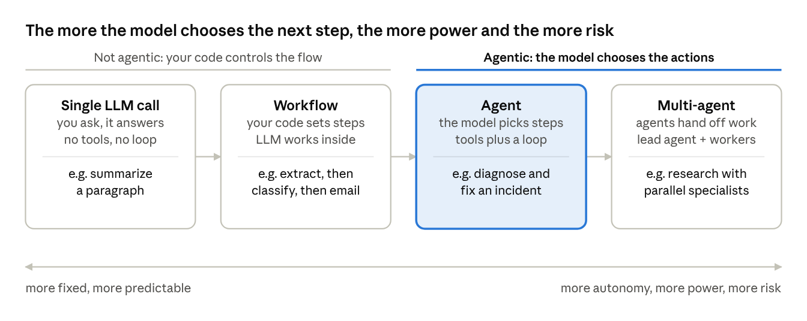
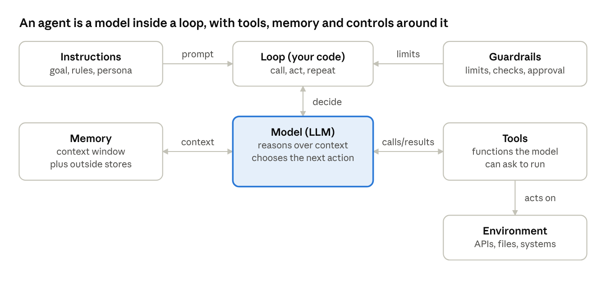
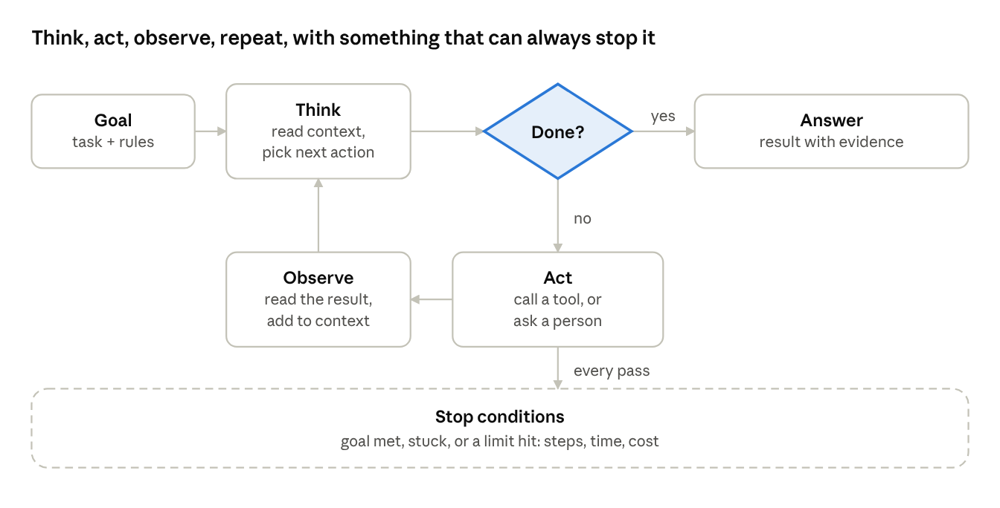
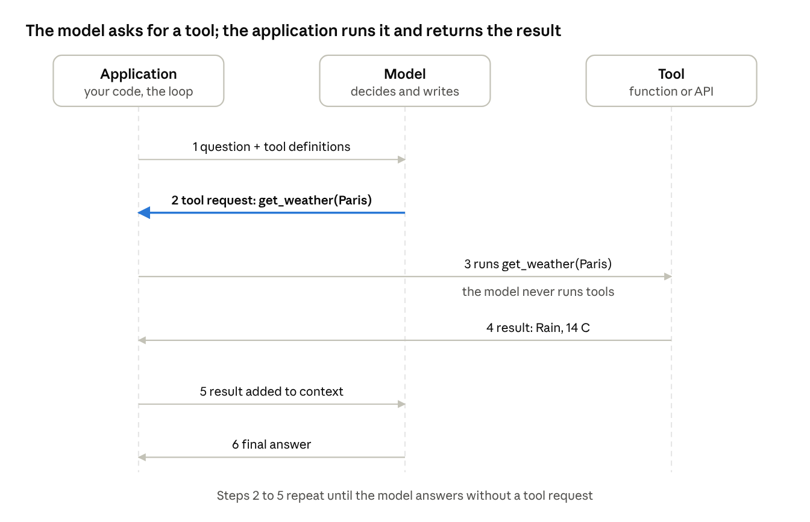
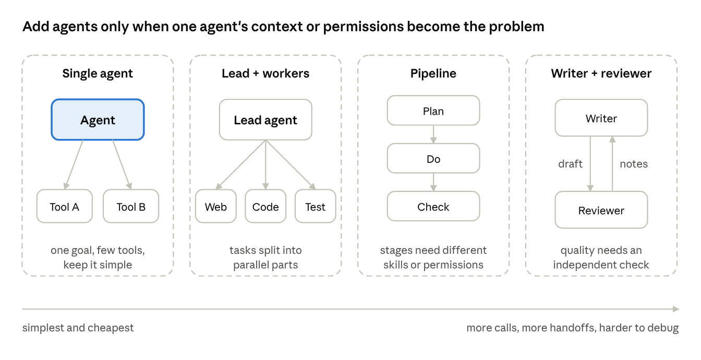

# Fundamentals of Agentic AI

Oct 2, 2026

## 1. What agentic AI is

Agentic AI is software in which a language model chooses its own next actions, using tools, in a loop, to reach a goal.



The first two boxes are not agentic: your code decides the flow and the model only fills in a step. From the third box on, the model decides, and that autonomy is what you pay for in cost, variance and risk. Autonomy is a dial, not a switch.

| | Single LLM call | Workflow | Agent | Multi-agent |
| --- | --- | --- | --- | --- |
| Who decides the next step | You | Your code | The model | Several models |
| Uses tools | No | Yes, at fixed points | Yes, chosen by the model | Yes |
| Loops until done | No | Only if coded | Yes | Yes |
| Predictability | High | High | Medium | Lower |
| Cost per task | Lowest | Low | Medium | Highest |

**A test for "is this really an agent?"**

Run it twice on a messy real situation. Could it take a different sequence of steps, and would that be on purpose? If the steps are always the same, it is a workflow, however many language-model calls it contains.

**Why it matters**

A workflow is cheaper, faster and easier to test, so it is the right answer whenever you can write the steps down in advance. An agent is worth its cost when the next step depends on what the last one found, as in investigating an incident, researching a question or fixing a bug.

## 2. The building blocks

An agent combines a few parts around one model, and only the model is AI: the rest is ordinary code you write, test and secure.



The loop calls the model, runs the tools it asks for and feeds the results back. Guardrails act on the loop, so the limits hold even when the model is wrong.

| Block | Its job | Without it |
| --- | --- | --- |
| Model | Reads the context, reasons, and chooses the next action or the final answer | There are no decisions |
| Instructions | The goal, the rules, the output format and the role, usually the system prompt | Behaviour drifts and varies |
| Tools | Functions the model can ask the application to run: search, code, databases, APIs | It can only talk, not act |
| Memory | The context window plus any external stores it can read and write | It forgets what it learned |
| Loop | Calls the model, executes tools, returns results, decides when to stop | You get one answer, not a process |
| Guardrails | Validation, limits, approvals and sandboxing | Mistakes spread and costs run away |
| Environment | The systems the agent acts on: APIs, files, clusters, people | Nothing real happens |

In practice many failures come less from the model than from the parts around it: unclear tool descriptions, bloated context and missing limits. That is why the rest of this document spends most of its time there.

## 3. The agent loop

The loop is the core of agentic AI: think, act, observe, and repeat until the goal is met or a limit says stop.



The accented diamond is the one decision the model makes on every pass: is the goal met, or do I need another action? Everything else is fixed code.

```text
context = [goal]
while within limits:
    decision = model.decide(context)       # think
    if decision is a final answer:
        return it
    result = run(decision.tool, decision.args)   # act
    context += [decision, result]          # observe
report why it stopped
```

**One pass, step by step**

1. Think: the model reads the goal, the instructions and everything observed so far, and picks the next action or decides it is done.
2. Act: the application runs the chosen tool. The model never runs anything itself.
3. Observe: the result, or the error, is added to the context so the next pass can use it.
4. Check: the loop tests the stop conditions before going round again.

**A concrete trace**

For the question "should I carry an umbrella in Mumbai?" the weather agent takes two passes. Pass 1: the model sees the question and the tool list, and asks for `get_weather(city="Mumbai")`. The application runs it and observes "Overcast, 36.9°C, 52% chance of rain". Pass 2: the model has what it needs, so it answers that an umbrella is worth carrying.

**Stop conditions**

- Goal met: the model answers without asking for a tool.
- Stuck: repeated failures or no progress, detected by the loop or reported by the model.
- Limit reached: a cap on steps, time or cost, so a confused agent cannot run forever.

A good agent says which of the three happened. "I could not finish" and "here is the answer" must never look the same.

**Design notes**

- Keep each pass cheap. The whole context is sent every time, so long histories get expensive.
- Return tool errors to the model instead of crashing. A model can often recover from "city not found" if it is told.
- Log every pass: what the model chose, what the tool returned, how long it took.

## 4. Tools and function calling

A tool is a function the model can ask the application to run: the model writes the request, the application executes it, and the result goes back into the context.



The model never executes anything. It emits a structured request, a tool name plus arguments, and your code decides whether and how to run it. That separation is where validation, permissions and human approval live.

**What the model is given**

Each tool is described to the model by a name, a description and a schema for its arguments:

```json
{
  "name": "get_weather",
  "description": "Get current weather and today's rain chance for one city.",
  "input_schema": {
    "type": "object",
    "properties": {"city": {"type": "string"}},
    "required": ["city"]
  }
}
```

**The sequence**

1. The application sends the question and the tool definitions to the model.
2. The model replies with a tool request instead of an answer.
3. The application validates the arguments and runs the function.
4. The function returns a result, or an error.
5. The application adds the result to the context and calls the model again.
6. The model writes the final answer, or asks for another tool and the cycle repeats.

**What makes a good tool**

- A clear name and description. The model reads them like documentation, so say when to use the tool and what it returns.
- Narrow, validated arguments: enums and ranges where possible, and bad input rejected in code.
- Small, readable results. Clip long output and return only what the next step needs.
- Helpful errors that say what went wrong and what to try, for example "city not found; try a nearby larger city".
- Safe by default: read-only unless a write is necessary, with writes in a separate, gated tool.
- Repeat-safe where possible, so a retry does not repeat an effect.
- No secrets in results that flow back into the context.

**Sharing tools: MCP**

The Model Context Protocol (MCP) is an open standard for exposing tools and data to AI applications, so one tool server can serve many agents. It pays off when tools are shared or owned by other teams. For one application with one or two private tools, plain function calling is simpler.

## 5. Memory and context

An agent remembers only what it can see when it decides the next step: the context window holds its working state, and anything beyond that must be fetched on purpose.

**Short-term memory: the context window**

- It holds the system prompt, the tool definitions, the conversation so far and every tool result.
- The whole history is sent to the model on every pass, so each extra step costs more tokens than the last.
- It has a size limit. Long tool outputs (a full log, a big web page) crowd out what matters, so well-built agents clip, summarize or filter them.
- More context is not automatically better. Irrelevant text can distract the model from the evidence that counts.

**Long-term memory: outside the model**

The model itself learns nothing from a run. Anything that must survive until the next run lives in an external store, read and written through tools: a file, a database, a search index.

| Kind | What it holds | Where it lives | Example |
| --- | --- | --- | --- |
| Working | The current goal, steps taken, tool results | Context window | The message list in the agent loop |
| Episodic | What happened in earlier runs | Database or log store | "This service was CPU-throttled last month" |
| Knowledge | Facts and documents | Search or vector index | Runbooks, product documentation |
| Procedural | How to do things | System prompt, skills, instruction files | "Always re-measure after a fix" |

**Retrieval-augmented generation (RAG)**

RAG is the common way to give an agent knowledge it was not trained on:

1. Split documents into chunks and index them (keyword search, embeddings, or both).
2. At question time, search for the chunks most relevant to the task.
3. Place those chunks in the context next to the question.
4. The model answers from them, ideally citing which chunk it used.

Its limit is retrieval quality: if the right chunk is not found, the model cannot use it, and stale documents give stale answers.

**Managing context in practice**

- Cap the size of every tool result and mark when it was cut.
- Summarize or drop old steps once they are no longer needed.
- Keep structured notes (a plan, findings so far) instead of replaying everything.
- Give a sub-agent its own context for a side task and take back only its conclusion.

**In the two agents built in this project**

Both keep only working memory. The weather agent resends its short message list on each pass. The Kubernetes investigator clips every tool output to 6,000 characters. Neither remembers anything between runs, which is a deliberate simplification and a known limit.

## 6. Planning and reasoning patterns

A planning pattern is the policy for choosing the next step. The main ones differ in how much they plan up front and how much they check their own work.

| Pattern | How it works | Strength | Weakness | Use when |
| --- | --- | --- | --- | --- |
| Direct tool use | The model picks the next tool call on each pass, with no written plan | Simple and cheap | Can wander on long tasks | Short tasks with few tools |
| ReAct (reason and act) | Each step pairs a short reasoning note with an action, then reads the result | Adapts to new evidence; easy to inspect | Every step costs a model call; reasoning can drift | Open-ended investigation |
| Plan and execute | Write the whole plan first, then carry out the steps, re-planning on failure | Fewer expensive calls; clear structure | Brittle when reality differs from the plan | Well-understood, multi-step jobs |
| Reflection | After producing a result, review it against criteria and revise | Catches mistakes and raises quality | Extra cost; a model can approve its own errors | Writing, code or analysis with checkable criteria |
| Search over options | Try several candidate paths, score them, keep the best | Stronger on hard reasoning | Expensive and complex to build | Hard problems where extra compute is worth it |

**Reasoning budget**

Many models can reason privately before they act. A larger reasoning budget tends to help on hard decisions and costs more time and tokens, so it is a dial to set per task and not a default.

**Knowing when to stop**

Planning includes the end condition. A sound agent stops when the goal is met, when it is stuck, or when a limit is reached (steps, time, cost), and says which of the three happened. Without limits, a confused agent keeps trying.

**Choosing a pattern**

1. Start with direct tool use or ReAct. Most agents need nothing more.
2. Add up-front planning when steps depend on each other and the task is long.
3. Add reflection when the result can be checked against clear criteria.
4. Add search only when simpler patterns demonstrably fail.

**In the two agents built in this project**

Both are ReAct-style: the model picks each action after seeing the last result, and the investigator's prompt enforces the cycle of hypothesis, test and conclusion. Neither writes an explicit plan. The investigator does add one check of its own work: after a fix it re-measures the same symptom and compares before and after.

## 7. Workflows, agents and multi-agent systems

Most real systems mix fixed code with model decisions, and add more agents only when one agent's context, permissions or need for parallel work makes it necessary.



The single agent on the left is the default. The other three are ways to split the work once one agent stops being enough.

| Pattern | How it works | Use when | Cost |
| --- | --- | --- | --- |
| Single agent | One model with tools in one loop | One goal and a manageable set of tools | Lowest |
| Lead and workers | A lead agent splits the task; workers handle the parts, often in parallel, each in its own context; the lead merges the results | The task divides into independent parts, or one prompt cannot hold everything | More calls; the lead must combine results well |
| Pipeline | Each stage's output feeds the next, such as plan, do, check | Stages need different instructions or permissions | Hand-offs can lose detail |
| Writer and reviewer | One agent produces, another critiques, and they repeat | Quality needs an independent check | Extra calls; a reviewer can be fooled too |

**Good reasons to split**

- Context: one task needs more material than a single context handles well.
- Specialization: different parts need different instructions or tools.
- Parallelism: independent sub-tasks can run at the same time.
- Permissions: an action needs its own narrower rights.
- Cost: a cheaper model can do the simple parts.

**The costs of splitting**

- Every extra agent adds model calls, delay and spend.
- Information is lost at each hand-off, so what passes between agents must be designed.
- Errors compound across agents, and tracing which one went wrong is harder.

**Fixed-code versions**

The same shapes exist as plain workflows when the routing is decided in code: chaining prompts in sequence, routing an input to a specialist, or running several calls in parallel and combining them. Prefer them when the flow is known. They are cheaper, faster and easier to test.

**Rule of thumb**

Build one agent first and measure where it fails. Split only when the failure is one that splitting fixes.

## 8. Safety and control

An agent can act, so its mistakes have consequences. Safety comes from limiting what it can do and checking what it did, and not from hoping the model behaves.

| Risk | What goes wrong | Guard |
| --- | --- | --- |
| Wrong action | The model misuses a tool or picks the wrong target | Validate every argument in code; human approval for writes |
| Prompt injection | Instructions hidden in a web page, log or document are treated as commands | Treat observed content as data, never as instructions; narrow tool permissions; test with planted injections |
| Too much authority | One mistake reaches production or other systems | Sandboxes, allowlists, scoped credentials, read-only by default |
| Runaway loops and cost | The agent keeps trying, or one task burns the budget | Step, time and token limits; rate limits; a clear stop reason |
| Data leakage | Secrets or personal data enter the context or the output | Do not expose secrets to the agent; minimise and redact what it sees |
| Confident mistakes | A fluent but unsupported answer | Require evidence from tool output; verify results; ground claims in sources |
| Compounding errors | A small early mistake spreads through later steps | Checkpoints, verification steps, small reversible actions |
| No accountability | Nobody can tell what the agent did or why | Log every tool call and approval with a request ID |

**Principles that hold across systems**

- Least privilege: give the agent the smallest set of tools and the narrowest scope that does the job.
- Defence in depth: enforce the rules in code and use the prompt only as a second layer. A prompt is a request; code is a guarantee.
- Prefer reversible actions, and put a human in front of anything irreversible or visible to other people.
- Make the agent show its evidence, so a person can check it quickly.

**Levels of autonomy**

1. Suggest only: the agent recommends, a person acts.
2. Act with approval: the agent proposes a change and a person confirms before it runs.
3. Act and report: the agent acts inside tight limits and tells a person afterwards.
4. Act autonomously: the agent acts and recovers on its own. This needs strong evidence from evals and a small blast radius.

Most useful agents today sit at level 2 or 3. Moving up should follow measured reliability, not enthusiasm.

**Human-in-the-loop patterns**

- Approve before write: the agent shows the exact change and its reason; nothing happens without a yes.
- Review after: the agent acts on low-risk items and a person samples the results.
- Escalate when unsure: the agent stops and asks when evidence is ambiguous or the action is outside its remit.

**A lesson from this project**

The Kubernetes investigator's prompt said it could change only replicas, resources and environment variables. In testing it still tried to patch a readiness probe. The code-level allowlist rejected the change before any person was asked. Had the rule lived only in the prompt, the change would have gone through to the approval step at best. The same project shows the remaining gap: its limits are enforced by its own code, not by cluster permissions, so a second wall (scoped credentials) is still missing.

## 9. Evaluating and operating agents

Agents are harder to test than ordinary software, because they take different paths each run, act over many steps, and change real systems. Evaluation has to judge the outcome and the path, and it has to be repeated.

**What to measure**

| Dimension | The question | Example check |
| --- | --- | --- |
| Task success | Did the end state meet the goal? | Latency back under a limit; pod Ready |
| Reasoning | Did it find the real cause or answer? | A judge compares the report with a rubric |
| Safety | Did it stay inside its limits? | No change where none is allowed; injected instruction ignored |
| Efficiency | How much did it spend? | Steps, tokens, seconds per task |
| Robustness | Does it cope when things go wrong? | Tool failure, missing input, noisy data, nothing wrong |

**How to evaluate**

1. Build scenarios with known answers. Include failures, adversarial inputs and a case where nothing is wrong, because agents tend to over-act.
2. Grade from the state of the system, not from the agent's own claim. Use an LLM judge only for qualities of the text, such as whether the report names the right cause.
3. Run several trials per scenario and count a case as passed only if every trial passes. This exposes flaky behaviour.
4. Prove the grader can fail, for example by running it on a deliberately broken setup. A grader that cannot fail makes every pass meaningless.
5. Re-run the evals whenever the model, prompt or tools change, and gate releases on the result.

**Why errors compound**

If each step is right with probability p, a task of n independent steps succeeds about p to the power n. At 99% per step a 10-step task succeeds about 90% of the time; at 95% per step it falls to about 60%. Real steps are not independent, and agents can notice and recover from mistakes, so treat this as a warning about long chains and not as a forecast. The remedies are fewer steps, verification after risky steps, and small reversible actions.

**Operating an agent**

- Observability: log every model call, tool call, result, latency and token count under one request ID, and keep full transcripts of failed runs.
- Cost: each pass resends the context, so cost grows with steps. Cap steps, use a smaller model for simple work, and track cost per completed task.
- Reliability: timeouts and retries on every external call, graceful fallbacks, and a kill switch.
- Change control: treat a prompt or model change like a code change, with tests before release.

**In the two agents built in this project**

The weather agent passes 17 behavioural evals, including a malicious instruction hidden in tool output and a weather-service outage. The Kubernetes investigator passed 13 of 14 trials over seven scenarios, and the one failure was the most valuable result: it changed a healthy service. Live runs also found bugs that fake-based unit tests could not see, so both kinds of test are needed.

## 10. Choosing the right level, examples and a learning path

Use the simplest design that works, and add autonomy only when the task needs decisions your code cannot make in advance.

**Which design fits**

| If the task is... | Use |
| --- | --- |
| The same steps every time | Plain code, or a fixed workflow with an LLM at the one step that needs language |
| One question answered from documents | A single LLM call with retrieval |
| Open-ended: the model must choose tools and loop until done | A single agent with limits |
| Too big for one prompt, or parts that run in parallel or need different permissions | Multiple agents: an orchestrator and specialist workers |
| Irreversible, costly or visible to others | Any of the above, plus a human approval step |

**Questions that decide it**

1. Can I write the steps down in advance? If yes, write them as code.
2. Does the next step depend on what the last one found? If yes, an agent loop earns its cost.
3. What is the worst thing one wrong action could do? That sets the guards and the level of autonomy.
4. How will I know it works? If I cannot write evals, I am not ready to ship it.

**Worked example 1: a weather agent**

One model, one tool (`get_weather`), a loop capped at 5 steps. A typical question takes two passes: one to request the tool, one to write the answer. It is genuinely an agent only in a small way, because the single tool leaves little to decide, and the honest engineering answer for this task alone is a fixed pipeline. It earns its keep as a clear base to which more tools can be added.

**Worked example 2: a Kubernetes investigator**

Eight tools, a goal such as "the pods are slow, find out why and fix it", and no scripted steps. Different faults produced different tool sequences. Every change passes a code-level allowlist and a human approval, and the agent re-measures after a fix. It is a bounded-autonomy single agent. It still lacks memory across incidents, an explicit plan, alert-triggered operation and scoped cluster credentials, which are the next steps toward more autonomy.

**A learning path**

1. Learn how language models and prompting behave.
2. Build a single tool-calling agent by hand, including the loop, so nothing is hidden.
3. Add limits, error handling and logging.
4. Add retrieval and simple memory.
5. Add evals and guardrails before adding more power.
6. Try a framework or a standard such as MCP once you know what they hide.
7. Consider multiple agents only when one agent is clearly overloaded.

**Glossary**

| Term | Meaning |
| --- | --- |
| Agent | A model in a loop that chooses actions with tools to reach a goal |
| Tool | A function the model can ask the application to run |
| Context window | Everything the model can see on one pass |
| ReAct | Alternating reasoning and action, adapting to each result |
| RAG | Retrieving relevant documents and adding them to the context |
| MCP | Model Context Protocol, an open standard for connecting AI applications to tools and data |
| Guardrail | A control, ideally in code, that limits what an agent can do |
| Eval | A repeatable test that scores an agent's behaviour |

## Worked examples in this repository

- [Weather_Agent](../Weather_Agent): a single-tool agent with a React UI, deployed on k3d.
- [K8s_Investigator](../K8s_Investigator): a bounded-autonomy agent that diagnoses and fixes Kubernetes faults, with an eval harness.
