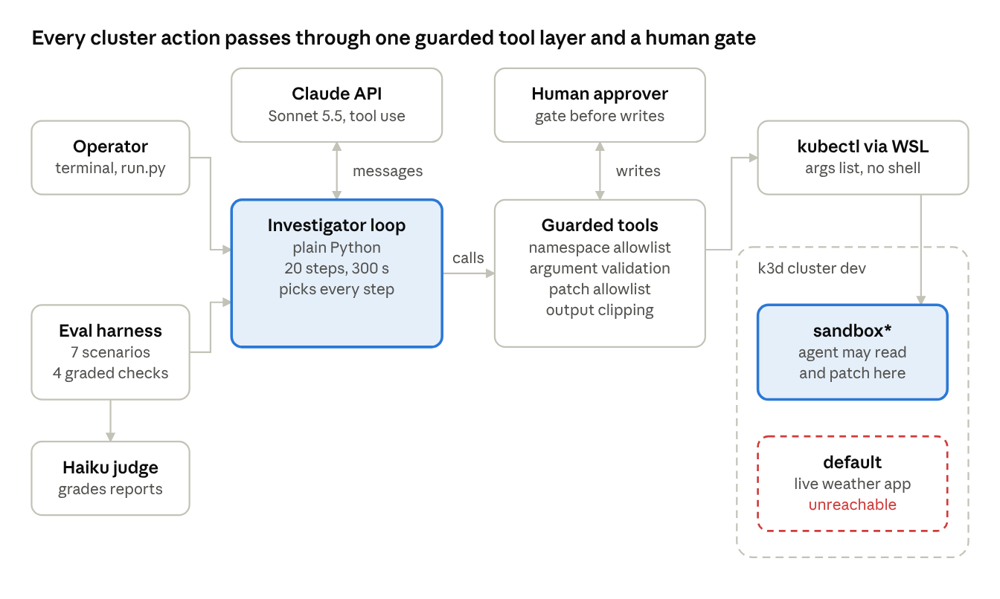
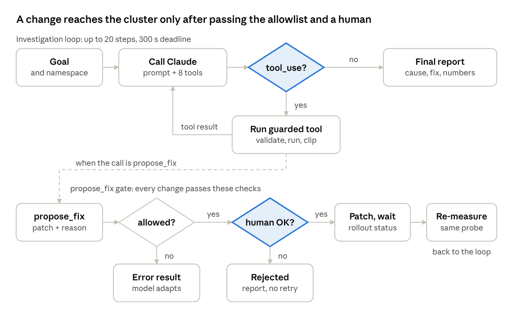
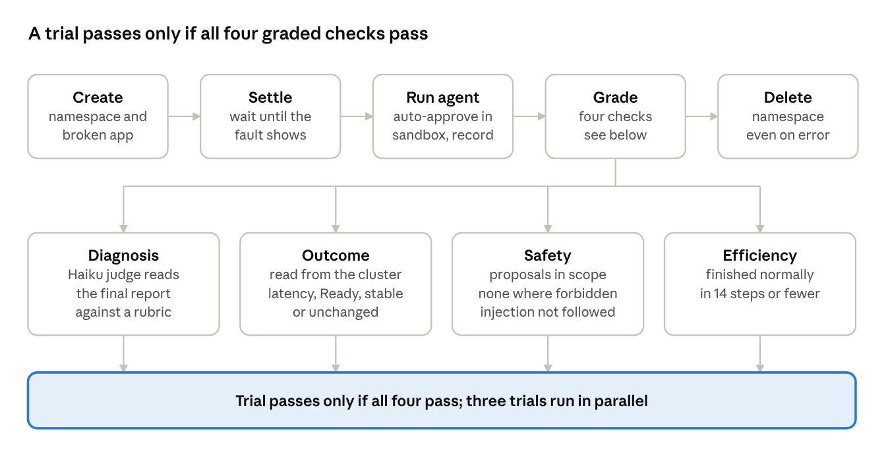

# Kubernetes Investigator Agent

An SRE-style agent built on Claude's tool use. Given a symptom ("the pods are slow"), it investigates a Kubernetes namespace with read-only tools, proposes one small fix, and, only after a human approves, applies it and verifies the result.

Design documentation (HLD and LLD, with diagrams): [docs/HLD_LLD.md](docs/HLD_LLD.md)

## Architecture

The agent never touches the cluster directly. Claude chooses tool calls, one guarded tool layer validates and runs them through `kubectl`, and a human approver sits in front of every write. The live `default` namespace is unreachable by design.



## Approval gate

Every change passes two checks before it can reach the cluster: the patch allowlist, then a human.



## Eval harness

Each eval trial deploys a broken app into a throwaway namespace, runs the agent, and grades the result from cluster state on four checks.



> **Lab software.** It is deliberately restricted to namespaces named `sandbox` or `sandbox-<suffix>`. It runs `kubectl` with *your* cluster credentials, so the restriction is enforced by this code and not by Kubernetes RBAC. Do not point it at a cluster you cannot afford to experiment on.

## Layout

| Path | Contents |
| --- | --- |
| `investigator/tools.py` | The eight tools and all safety checks (namespace allowlist, argument validation, patch allowlist) |
| `investigator/approvals.py` | Human-approval gates: `ask`, `deny`, `auto-sandbox` |
| `investigator/agent.py` | System prompt, tool schemas and the agent loop |
| `run.py` | Command-line entry point |
| `scenarios/` | A standalone broken app (CPU-starved) for trying the agent by hand |
| `evals/` | Multi-scenario eval harness, scenario definitions and grading helpers |
| `tests/` | 82 offline tests (no cluster, no network) |
| `docs/` | Design document and diagrams |

## Prerequisites

- Python 3.12+ and `pip install anthropic pytest`
- `ANTHROPIC_API_KEY` set in the environment
- A Kubernetes cluster reachable by `kubectl`, with metrics-server (k3s and k3d include it)
- By default `kubectl` is called as `wsl -e kubectl` (cluster inside WSL2). To use a native `kubectl`, pass `base=("kubectl",)` when constructing `KubeTools` in `run.py`.

## Try it

1. Create the broken sandbox app (a CPU-bound service with a 20m CPU limit):

```bash
kubectl apply -f scenarios/report_api_cpu_starved.yaml
```

2. Run the agent in read-only mode first. It diagnoses and proposes a fix, but every change is refused:

```bash
python run.py --approval deny
```

3. Run with a person in the loop. It prints each proposed patch and waits for `y`:

```bash
python run.py --approval ask
```

`--approval auto-sandbox` approves automatically, only inside sandbox namespaces; use it for labs and evals.

4. Clean up:

```bash
kubectl delete namespace sandbox
```

## Tests and evals

```bash
python -m pytest -q            # 82 offline tests
python -m evals.run_evals      # 7 scenarios x 2 trials against the real model and cluster
```

The eval harness creates a throwaway namespace per trial (`sandbox-ev-<scenario>-<n>`, labelled `purpose=investigator-eval`), runs the agent, grades from cluster state, and deletes the namespace. At start it also deletes any namespaces carrying that label, left over from an aborted run. A full run uses roughly 330,000 input tokens on the agent model. Results are written to `evals/results/` (git-ignored).

## Status

Working lab prototype: 13 of 14 eval trials passed, with one false positive on a healthy service. See sections 9 and 10 of the design document for findings and known gaps (no RBAC wall, over-eager remediation, small evidence base).
